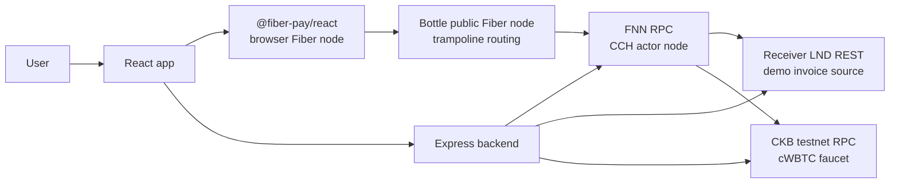
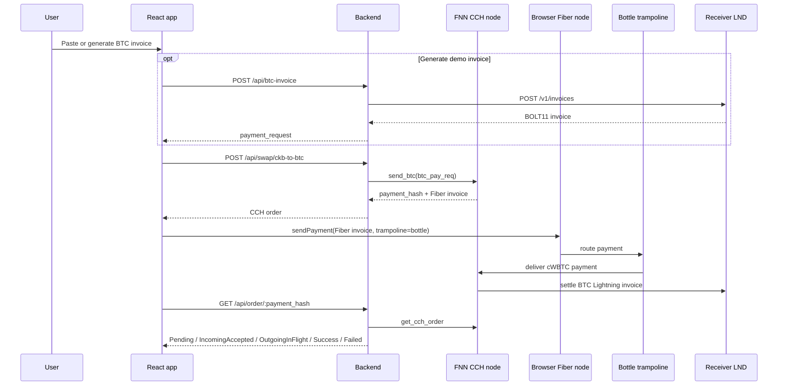

# Fiber Swap Demo

Demo app for paying a Bitcoin Lightning invoice from CKB testnet through Fiber CCH.

The user pastes or generates a BTC testnet Lightning invoice, the backend asks an FNN node to create a CCH order, and the browser Fiber node pays the returned Fiber invoice with test cWBTC. The FNN node then settles the original BTC invoice through LND.

## Architecture



| Piece | Role |
| --- | --- |
| React app | Collects BTC invoices, shows quotes/orders, starts browser-node payments, and exposes `/faucet`. |
| Browser Fiber node | Local sender node from `@fiber-pay/react`; pays the CCH Fiber invoice with cWBTC. |
| Express backend | Thin API layer around FNN RPC, LND REST, quotes, order status, and faucet claims. |
| FNN CCH node | Creates CCH orders with `send_btc`, receives Fiber-side cWBTC, and pays BTC invoices. |
| Receiver LND | Generates demo BTC testnet invoices for the frontend generate button. |
| Bottle node | Public Fiber node used as a trampoline hop for browser-node routing. |
| cWBTC faucet | Sends small cWBTC test amounts to CKB testnet addresses. |

## Payment Flow



## cWBTC

This demo uses a testnet xUDT as wrapped BTC for Fiber CCH.

```json
{
  "code_hash": "0x25c29dc317811a6f6f3985a7a9ebc4838bd388d19d0feeecf0bcd60f6c0975bb",
  "hash_type": "type",
  "args": "0x9a1086531ed6dc69e0bd44cef5278e03faf3015b31aff60b08fb87663ce8507100000000"
}
```

Cell dep:

```json
{
  "out_point": {
    "tx_hash": "0xbf6fb538763efec2a70a6a3dcb7242787087e1030c4e7d86585bc63a9d337f5f",
    "index": "0x0"
  },
  "dep_type": "code"
}
```

The token has 8 decimals. Faucet amounts are raw units, so `1000` means `0.00001 cWBTC`.

## API Surface

| Endpoint | Purpose |
| --- | --- |
| `GET /api/health` | Backend health plus FNN connectivity check. |
| `GET /api/node-info` | FNN node pubkey, addresses, channel count, and peer count. |
| `POST /api/quote` | Demo quote from sats to CKB. Currently uses a fixed rate. |
| `POST /api/btc-invoice` | Creates a BTC testnet invoice on receiver LND. |
| `POST /api/swap/ckb-to-btc` | Creates a CCH order by calling FNN `send_btc`. |
| `GET /api/order/:payment_hash` | Reads CCH order status from FNN. |
| `POST /api/faucet/claim` | Sends faucet cWBTC to a CKB testnet address. |

## Local Development

Install dependencies:

```bash
npm install
cd backend && npm install
```

Run the frontend:

```bash
npm run dev
```

Run the backend:

```bash
cd backend
npm run dev
```

Build both:

```bash
npm run build
cd backend && npm run build
```

## Backend Configuration

The backend reads configuration from environment variables.

| Variable | Default | Notes |
| --- | --- | --- |
| `PORT` | `3001` | Backend HTTP port. |
| `FNN_RPC_URL` | `http://127.0.0.1:8227` | FNN JSON-RPC endpoint. |
| `CORS_ORIGIN` | localhost plus demo domains | Comma-separated allowlist. |
| `LND_REST_URL` | `https://127.0.0.1:8080` | Receiver LND REST endpoint. |
| `LND_MACAROON_PATH` | `/home/retric/.lnd/.../invoices.macaroon` | Invoice macaroon for generating demo invoices. |
| `LND_TLS_CERT_PATH` | `/home/retric/.lnd/tls.cert` | TLS cert used by LND REST. |
| `BTC_INVOICE_AMOUNT_SATS` | `100` | Amount for generated demo invoices. |
| `FAUCET_PRIVATE_KEY` | unset | Enables `/faucet`; keep out of git. |
| `CKB_RPC_URL` | `https://testnet.ckbapp.dev/` | CKB testnet RPC for faucet transactions. |
| `FAUCET_CLAIM_AMOUNT` | `1000` | Raw cWBTC units per claim. |
| `FAUCET_COOLDOWN_SECONDS` | `60` | In-memory per-address cooldown. |

## Faucet Notes

The faucet is intended for a single-process demo deployment:

- same-address claims are guarded with an in-memory in-flight set and cooldown
- all faucet transactions are serialized through a process-local queue
- multi-process or multi-host deployment should move claim state to Redis or a database
- higher-volume faucets should split cWBTC across multiple cells or use a background worker

Never commit `.env` files or private keys.
