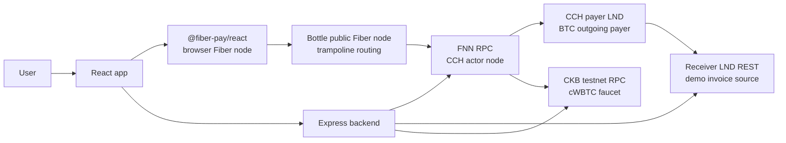
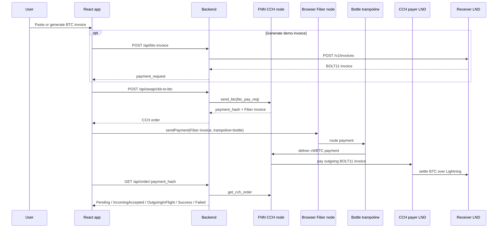
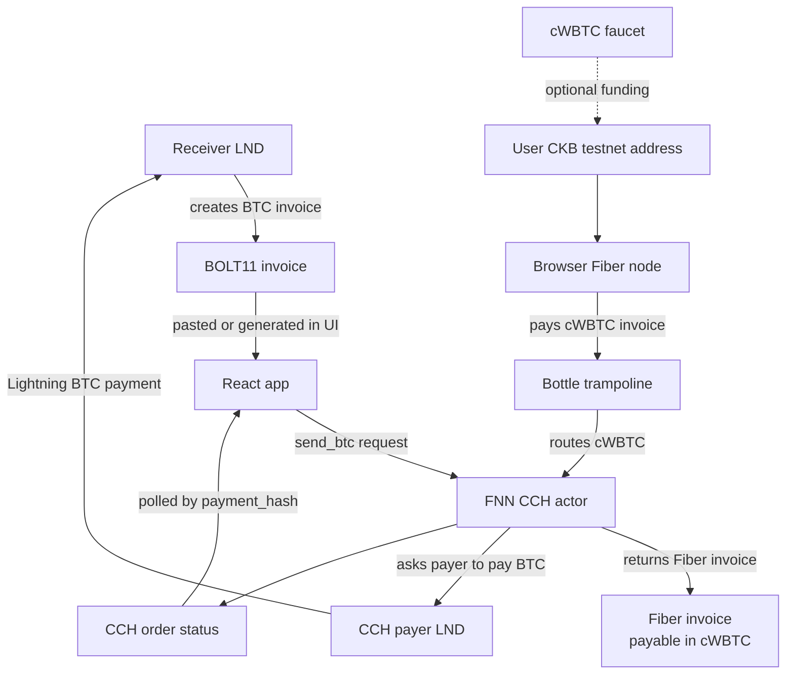

# Fiber Swap Demo

Demo app for swapping between Bitcoin Lightning and CKB testnet cWBTC in both directions through Fiber CCH.

- **cWBTC → BTC** (`send_btc`): the user pastes or generates a BTC testnet Lightning invoice, the backend asks an FNN node to create a CCH order, and the browser Fiber node pays the returned Fiber invoice with test cWBTC. The FNN CCH actor then asks its own payer LND node to settle the original BTC invoice.
- **BTC → cWBTC** (`receive_btc`): the browser Fiber node signs a cWBTC receive invoice (SHA256 hash algorithm — the payment hash is shared with the Lightning side), the backend creates a CCH order, and the user pays the returned Lightning invoice from any BTC testnet wallet. The CCH actor then pays the user's Fiber invoice with cWBTC.

The HTTP API exposes both directions, so external integrators (e.g. an acceptance CI running a daily bidirectional transfer) can drive swaps without the UI. See [API Surface](#api-surface).

For bear deployment and operational context, see [`docs/HANDOFF.md`](docs/HANDOFF.md).
For a Nervos Talks style write-up of the demo, see [`docs/nervos-talks-cch-demo.md`](docs/nervos-talks-cch-demo.md).

## Architecture



| Piece | Role |
| --- | --- |
| React app | Collects BTC invoices, shows quotes/orders, starts browser-node payments, and exposes `/faucet`. |
| Browser Fiber node | Local sender node from `@fiber-pay/react`; pays the CCH Fiber invoice with cWBTC. |
| Express backend | Thin API layer around FNN RPC, LND REST, quotes, order status, and faucet claims. |
| FNN CCH node | Creates CCH orders with `send_btc`, receives Fiber-side cWBTC, and coordinates BTC settlement. |
| CCH payer LND | The Lightning node used by the CCH actor to pay outgoing BTC invoices. |
| Receiver LND | Separate Lightning node used by this demo to generate invoices and receive BTC. |
| Bottle node | Public Fiber node used as a trampoline hop for browser-node routing. |
| cWBTC faucet | Sends small cWBTC test amounts to CKB testnet addresses. |

In the hosted demo there are two LND nodes:

- CCH payer LND: attached to the FNN CCH actor; it spends BTC liquidity.
- Receiver LND: attached to the demo backend only for `POST /api/btc-invoice`; it creates the invoice the user is trying to pay.

Keeping these separate makes the demo end-to-end: the user pays cWBTC on Fiber, and a different Lightning node receives BTC.

## Payment Flow



## End-to-End Asset Flow

This diagram separates invoices from value movement.



Value direction:

1. Test cWBTC moves from the user's browser Fiber node to the FNN CCH actor.
2. BTC testnet sats move from the CCH payer LND to the receiver LND.
3. The backend does not custody either side of the swap; it only brokers API calls and generates demo receiver invoices.

## cWBTC

This demo uses a testnet xUDT as wrapped BTC for Fiber CCH.

```json
{
  "code_hash": "0x25c29dc317811a6f6f3985a7a9ebc4838bd388d19d0feeecf0bcd60f6c0975bb",
  "hash_type": "type",
  "args": "0x9a1086531ed6dc69e0bd44cef5278e03faf3015b31aff60b08fb87663ce8507100000000"
}
```

Cell dep:

```json
{
  "out_point": {
    "tx_hash": "0xbf6fb538763efec2a70a6a3dcb7242787087e1030c4e7d86585bc63a9d337f5f",
    "index": "0x0"
  },
  "dep_type": "code"
}
```

The token has 8 decimals. Faucet configuration stores amounts as raw units, but user-facing API/UI fields display decimal cWBTC. For example, raw `5000000000` is shown as `50 cWBTC`.

## API Surface

| Endpoint | Purpose |
| --- | --- |
| `GET /api/health` | Backend health plus FNN connectivity check. |
| `GET /api/node-info` | FNN node pubkey, addresses, channel count, and peer count. |
| `POST /api/quote` | Demo quote from sats to cWBTC using the CCH wrapped-BTC unit convention. |
| `POST /api/btc-invoice` | Creates a BTC testnet invoice on receiver LND. |
| `POST /api/swap/ckb-to-btc` | Creates a CCH order by calling FNN `send_btc`. Body: `{ btc_pay_req, btc_sats? }`. |
| `POST /api/swap/btc-to-ckb` | Creates a CCH order by calling FNN `receive_btc`. Body: `{ fiber_pay_req }` — a signed cWBTC Fiber invoice from the payee's own node. |
| `GET /api/order/:payment_hash` | Reads CCH order status from FNN. 404 when the order is unknown. |
| `POST /api/faucet/claim` | Sends faucet cWBTC to a CKB testnet address. |

Swap responses include `payment_hash`, `direction` (`ckb-to-btc` | `btc-to-ckb`), the `incoming_invoice` the payer must pay (a `fibt...` Fiber invoice for ckb-to-btc, an `lntb...` Lightning invoice for btc-to-ckb), `outgoing_pay_req`, `amount_sats`/`fee_sats` (hex), and `status`. Poll `GET /api/order/:payment_hash` until `Success` / `Failed`.

### Notes for API integrators

- **The Fiber invoice for `receive_btc` must use the SHA256 hash algorithm** (`hash_algorithm: "sha256"` in `new_invoice`). The payment hash is shared with the Lightning hold invoice, and LND only speaks SHA256. The default `ckb_hash` invoice is rejected by FNN with "CKB invoice hash algorithm is not SHA256".
- Create a **fresh** Fiber invoice per order. Re-submitting the same `fiber_pay_req` is not idempotent on fnn v0.9.0-rc7 — LND rejects the duplicate hold invoice ("invoice with payment hash already exists"). After an order expires or fails, generate a new invoice instead of retrying the old one.
- FNN-side validation errors are returned as `400` with `upstream: true` and the upstream FNN message, so CI logs stay actionable. (We deliberately avoid 5xx here: the CDN in front of the API replaces 5xx bodies with its own error page, which would hide the message.) Request-shape problems are plain `400` without `upstream`.
- The swap only moves value once both legs settle atomically under the same payment hash; unpaid orders simply expire (`cch-order-expiry-delta-seconds`, default 36h).

## Local Development

Install dependencies:

```bash
npm install
cd backend && npm install
```

Run the frontend:

```bash
npm run dev
```

Run the backend:

```bash
cd backend
npm run dev
```

Build both:

```bash
npm run build
cd backend && npm run build
```

## Vendored fiber-js bundle

The browser loads `@nervosnetwork/fiber-js` through an import map pointing at
`public/@nervosnetwork/fiber-js.js` (see `index.html`). The SDK imports the
package with `@vite-ignore`, so the **vendored file — not the npm package — is
what actually runs in the browser**. When bumping `@nervosnetwork/fiber-js` in
`package.json`, regenerate the vendored bundle from the installed package:

```bash
npx esbuild --bundle node_modules/@nervosnetwork/fiber-js/dist/index.js \
  --format=esm --platform=browser --minify --target=esnext \
  --outfile=public/@nervosnetwork/fiber-js.js
```

## Backend Configuration

The backend reads configuration from environment variables.

| Variable | Default | Notes |
| --- | --- | --- |
| `PORT` | `3001` | Backend HTTP port. |
| `FNN_RPC_URL` | `http://127.0.0.1:8227` | FNN JSON-RPC endpoint. |
| `CORS_ORIGIN` | localhost plus demo domains | Comma-separated allowlist. |
| `LND_REST_URL` | `https://127.0.0.1:8080` | Receiver LND REST endpoint for demo invoice generation. |
| `LND_MACAROON_PATH` | `/home/retric/.lnd/.../invoices.macaroon` | Receiver LND invoice macaroon. |
| `LND_TLS_CERT_PATH` | `/home/retric/.lnd/tls.cert` | Receiver LND TLS cert. |
| `BTC_INVOICE_AMOUNT_SATS` | `100` | Amount for generated demo invoices. |
| `FAUCET_PRIVATE_KEY` | unset | Enables `/faucet`; keep out of git. |
| `CKB_RPC_URL` | `https://testnet.ckbapp.dev/` | CKB testnet RPC for faucet transactions. |
| `FAUCET_CLAIM_AMOUNT` | `5000000000` | Raw cWBTC units per claim. |
| `FAUCET_COOLDOWN_SECONDS` | `60` | In-memory per-address cooldown. |

## Faucet Notes

The faucet is intended for a single-process demo deployment:

- same-address claims are guarded with an in-memory in-flight set and cooldown
- all faucet transactions are serialized through a process-local queue
- multi-process or multi-host deployment should move claim state to Redis or a database
- higher-volume faucets should split cWBTC across multiple cells or use a background worker

Never commit `.env` files or private keys.
