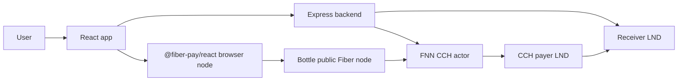
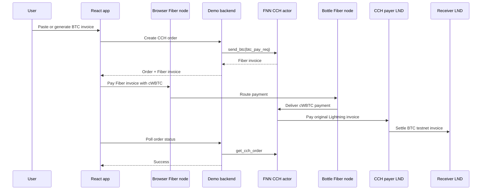

# Paying a Bitcoin Lightning Invoice with cWBTC on Fiber

> Draft for Nervos Talks.

Fiber's Cross-Chain Hub, or CCH, is one of the most interesting pieces of the current Fiber stack: it lets a Fiber payment trigger settlement on another payment network. In this demo, the user pays with a CKB testnet UDT that represents wrapped BTC, and a backend Fiber CCH node settles a Bitcoin testnet Lightning invoice through LND.

The hosted demo is here:

- Demo: <https://fiber-swap.retric.uk>
- API: <https://fiber-swap-api.retric.uk>
- Repo: <https://github.com/humble-little-bear/fiber-swap-demo>

This is a testnet-only demo. Do not send mainnet funds.

## What the Demo Shows

The user starts with a Bitcoin Lightning invoice, either pasted from another wallet or generated by the demo. The app asks a Fiber node to create a CCH order for that invoice. The browser then pays the returned Fiber invoice with test cWBTC. Once the Fiber payment is accepted, the CCH node uses its LND node to pay the original Bitcoin Lightning invoice.

From a user's point of view, the flow is simple:

1. Generate or paste a Bitcoin testnet Lightning invoice.
2. Create a Fiber CCH order.
3. Pay the Fiber invoice with cWBTC from a browser Fiber node.
4. Watch the order settle as the receiver LND gets BTC testnet sats.

The important part is that this is not a UI-only simulation. In the end-to-end test, a Fiber UDT payment is delivered to the CCH actor, and a separate LND node receives a real Bitcoin testnet Lightning payment.

## Architecture



The demo intentionally uses two LND nodes:

- The CCH payer LND belongs to the Fiber CCH actor. It pays outgoing Bitcoin Lightning invoices.
- The receiver LND belongs to the demo app. It creates invoices and receives the Bitcoin side of the payment.

This separation matters. If the same LND node created and paid the invoice, the demo would mostly be a self-payment test. With two nodes, we can demonstrate the full path: cWBTC comes in through Fiber, and BTC testnet sats arrive at a different Lightning receiver.

## The End-to-End Payment Flow



The value flow is:

- cWBTC moves from the user's browser Fiber node to the backend FNN CCH actor.
- BTC testnet sats move from the CCH payer LND to the receiver LND.
- The backend coordinates the order, but the interesting work happens in Fiber CCH and LND.

## Why cWBTC?

Fiber CCH needs an asset on the Fiber side to represent the value being paid. For this demo we issued a CKB testnet xUDT named cWBTC, with 8 decimals, and configured FNN to treat it as the wrapped BTC asset for CCH.

The testnet cWBTC type script is:

```json
{
  "code_hash": "0x25c29dc317811a6f6f3985a7a9ebc4838bd388d19d0feeecf0bcd60f6c0975bb",
  "hash_type": "type",
  "args": "0x9a1086531ed6dc69e0bd44cef5278e03faf3015b31aff60b08fb87663ce8507100000000"
}
```

For users, the UI displays decimal cWBTC, for example `0.00001 cWBTC`. Internally, the UDT uses raw units. That distinction is small but important: humans should not have to reason about raw xUDT units during a payment demo.

## Routing Through Bottle

The browser Fiber node routes through Bottle, a public Fiber node used as a trampoline hop. This keeps the browser experience lightweight, but it also introduces a very real Lightning-style operational concern: liquidity has direction.

For users to pay the backend CCH node through Bottle:

- the user's browser node needs outbound cWBTC liquidity toward Bottle
- Bottle needs outbound cWBTC liquidity toward the backend FNN
- the backend FNN must have an open cWBTC channel with Bottle

In practice, this means simply opening a channel is not enough. The channel also needs balance on the side that will forward payments. We tested this by keysend rebalancing cWBTC from the backend FNN to Bottle, so Bottle can forward payments into the backend CCH node.

That is a nice reminder: Fiber CCH gives us a cross-chain payment primitive, but it still lives in a routed payment network. Liquidity and routing are part of the application design.

## Operational Lessons

The demo ended up teaching a few concrete lessons that are useful for anyone building with CCH:

1. Separate the payer and receiver LND nodes.

   It makes the demo honest. The CCH actor should pay an external Lightning invoice, not just close a loop inside one node.

2. Treat LND wallet unlock as an explicit runbook step.

   PM2 can restart LND processes after a reboot, but LND wallets still need to be unlocked. If the CCH payer LND is locked, the Fiber side may accept or prepare a payment while BTC settlement cannot proceed.

3. Persist process supervision state.

   After adding FNN or LND services under PM2, run `pm2 save`. Otherwise the process may be online today but disappear after a reboot.

4. Keep the asset unit boundary clean.

   Raw xUDT units are correct for protocol and config, but the UI should speak in cWBTC decimals.

5. Watch channel direction, not only channel existence.

   A `CHANNEL_READY` status is not enough for multi-hop success. The right side of the channel needs spendable balance for the direction of the payment.

6. Restrict RPC surfaces.

   FNN RPC and LND RPC/REST are operational interfaces, not public product APIs. In a production deployment, bind them to localhost or put them behind a deliberate private network boundary.

## Why This Matters

The demo is small, but the shape is powerful. Fiber can be the CKB-side payment rail for user assets, while CCH connects that payment to an external settlement network. In this case the external network is Bitcoin Lightning, but the mental model is broader:

- Fiber handles fast routed payment of a CKB-native asset.
- CCH watches that incoming payment and coordinates a corresponding outgoing payment.
- The application can expose a simple UX while keeping the payment rails explicit.

For developers, this opens a path to build payment experiences where CKB assets can interact with existing Lightning invoices. For users, it makes a cross-network payment feel like one flow instead of two disconnected wallet operations.

## Current Status

The current testnet demo has:

- a browser Fiber node powered by `@fiber-pay/react`
- a backend FNN CCH actor on Fiber testnet
- testnet cWBTC configured as the wrapped BTC asset
- a public Bottle route for Fiber payments
- a CCH payer LND for outgoing BTC testnet payments
- a separate receiver LND for generated demo invoices
- a small cWBTC faucet for testing

The end-to-end path has been verified with a 100 sat Bitcoin testnet invoice: the Fiber-side cWBTC payment succeeded, the CCH order reached `Success`, and the receiver LND invoice was settled.

This is still testnet infrastructure, and it should be treated like a developer demo rather than production payment software. But it is enough to show the core CCH idea in motion: pay on Fiber, settle on Lightning.
